# Jira - Product Backlog
## Sistema Bancario Bankify - DOSW Laboratorio 3

**Equipo:** Hever Barrera, Nicolás Prieto, Mabel Bernal
**Proyecto Jira:** https://teamdosw.atlassian.net

---

## 1. Épica

| Campo       | Detalle                                      |
|-------------|----------------------------------------------|
| ID          | SCRUM-1                                      |
| Título      | Login Seguro y Operación Base de Depósitos   |
| Link        | https://teamdosw.atlassian.net/browse/SCRUM-1 |

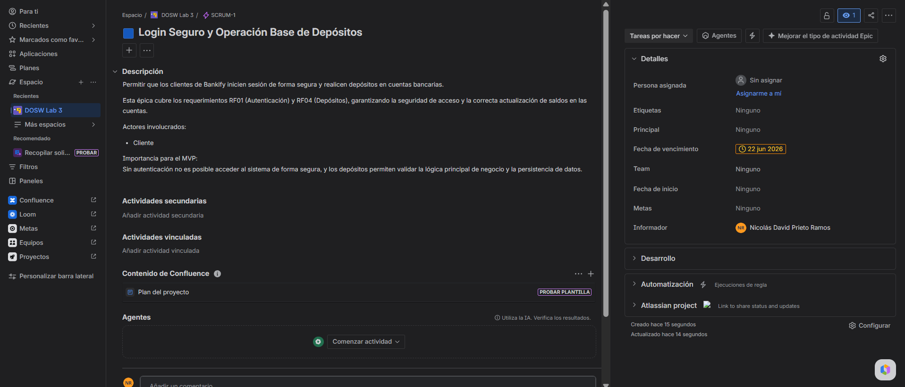

[Ver épica en Jira](https://teamdosw.atlassian.net/browse/SCRUM-1)

---

## 2. Historias de Usuario

### SCRUM-2 - Login con usuario y contraseña

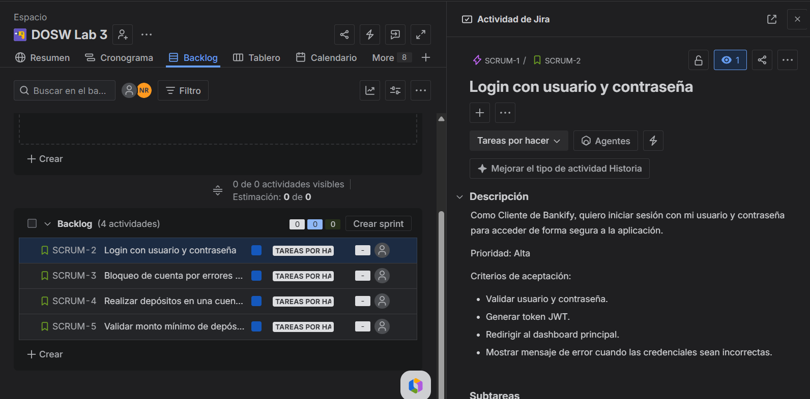

[Ver historia en Jira](https://teamdosw.atlassian.net/browse/SCRUM-2)

---

### SCRUM-3 - Bloqueo de cuenta por errores seguidos

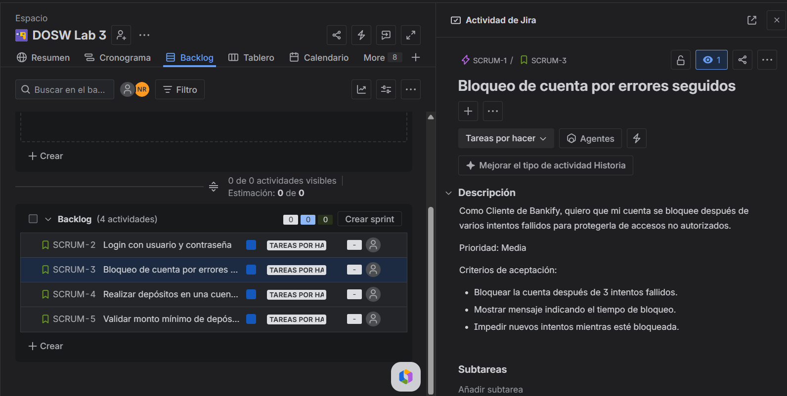

[Ver historia en Jira](https://teamdosw.atlassian.net/browse/SCRUM-3)

---

### SCRUM-4 - Realizar depósitos en una cuenta bancaria

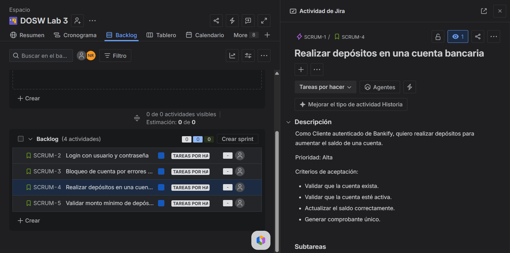

[Ver historia en Jira](https://teamdosw.atlassian.net/browse/SCRUM-4)

---

### SCRUM-5 - Validar monto mínimo de depósito

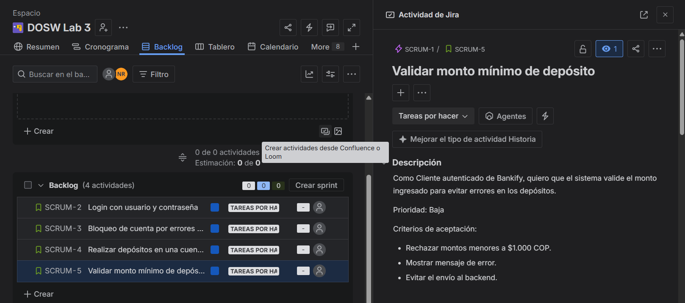

[Ver historia en Jira](https://teamdosw.atlassian.net/browse/SCRUM-5)

---

## 3. Tareas

### SCRUM-6 - Definir integración frontend-backend para login

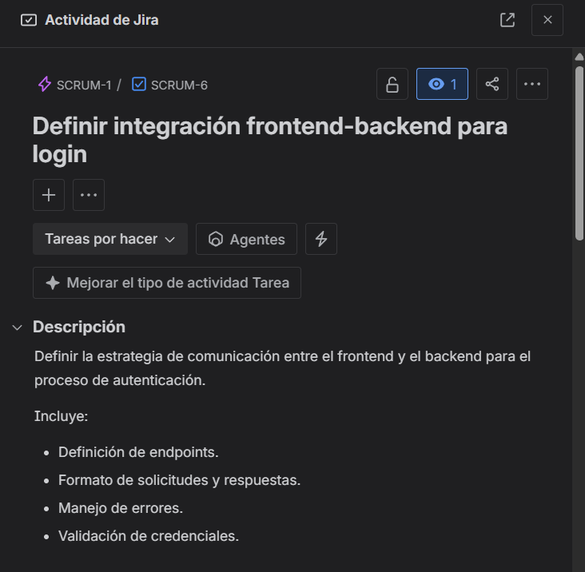

[Ver tarea en Jira](https://teamdosw.atlassian.net/browse/SCRUM-6)

---

### SCRUM-7 - Implementar autenticación y gestión de sesión

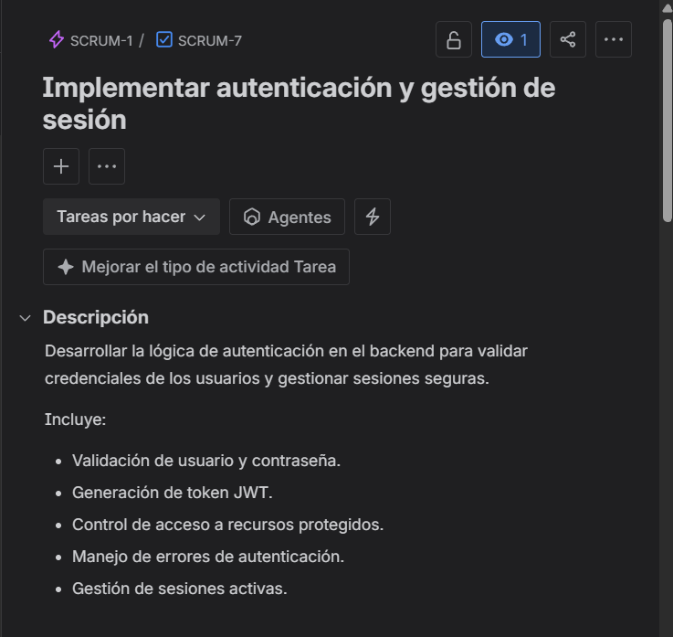

[Ver tarea en Jira](https://teamdosw.atlassian.net/browse/SCRUM-7)

---

### SCRUM-8 - Desarrollar pantalla de login y validaciones

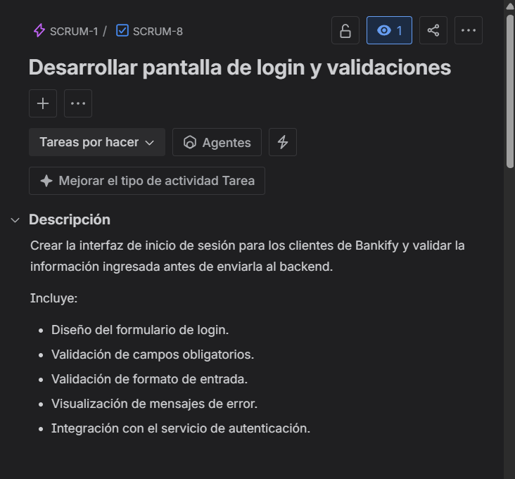

[Ver tarea en Jira](https://teamdosw.atlassian.net/browse/SCRUM-8)

---

### SCRUM-9 - Agregar campos de intentos fallidos en la base de datos

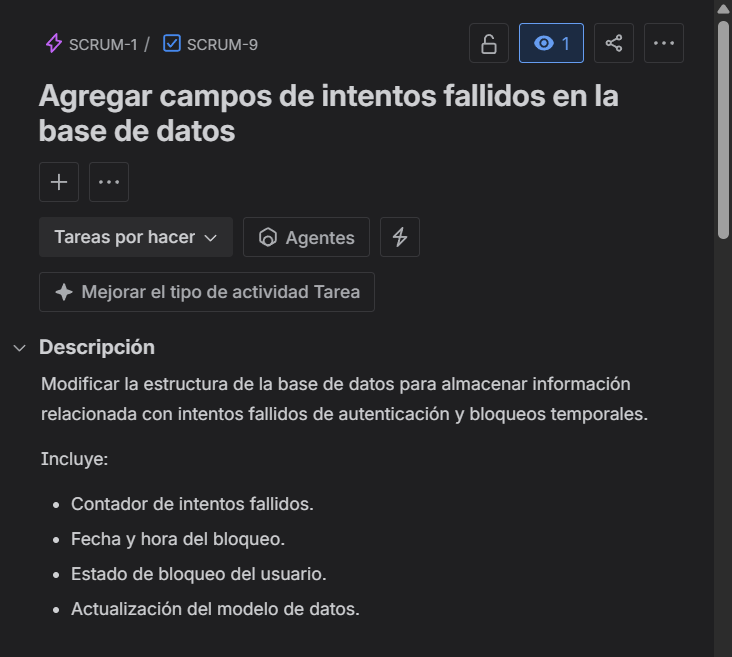

[Ver tarea en Jira](https://teamdosw.atlassian.net/browse/SCRUM-9)

---

### SCRUM-10 - Implementar lógica de bloqueo y desbloqueo

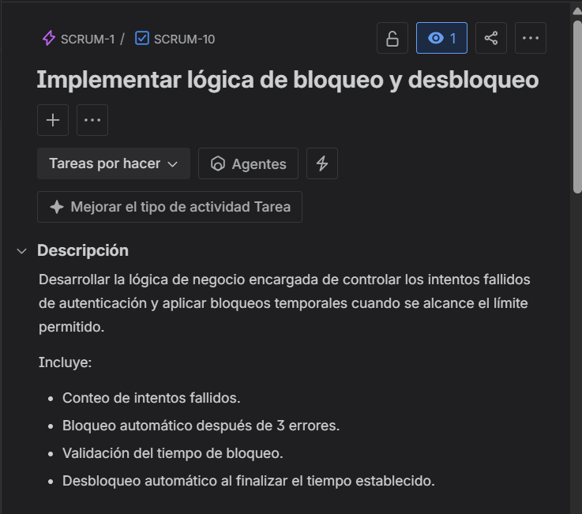

[Ver tarea en Jira](https://teamdosw.atlassian.net/browse/SCRUM-10)

---

### SCRUM-11 - Crear pruebas automáticas para bloqueo

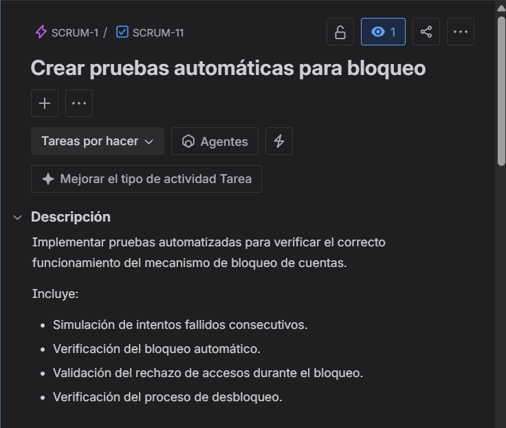

[Ver tarea en Jira](https://teamdosw.atlassian.net/browse/SCRUM-11)

---

### SCRUM-12 - Diseñar endpoint de depósitos

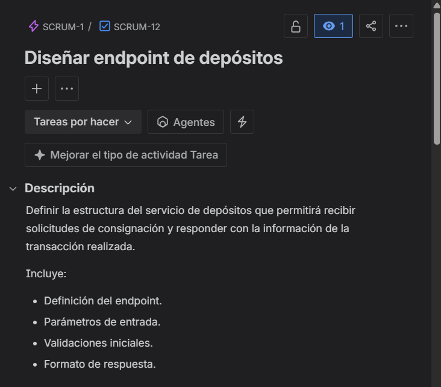

[Ver tarea en Jira](https://teamdosw.atlassian.net/browse/SCRUM-12)

---

### SCRUM-13 - Implementar actualización de saldo y registro de depósito

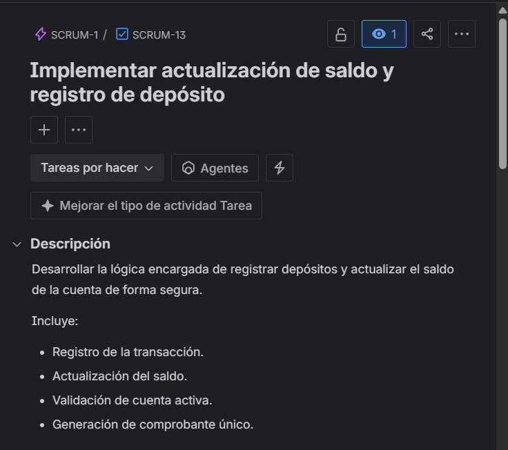

[Ver tarea en Jira](https://teamdosw.atlassian.net/browse/SCRUM-13)

---

### SCRUM-14 - Desarrollar formulario de depósitos

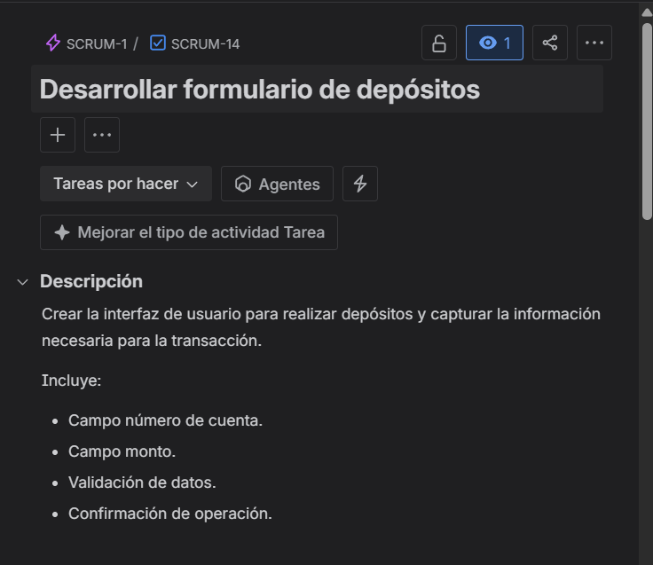

[Ver tarea en Jira](https://teamdosw.atlassian.net/browse/SCRUM-14)

---

### SCRUM-15 - Implementar validación de monto mínimo

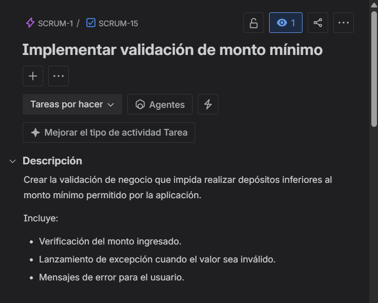

[Ver tarea en Jira](https://teamdosw.atlassian.net/browse/SCRUM-15)

---

### SCRUM-16 - Diseñar mensajes de error para depósitos inválidos

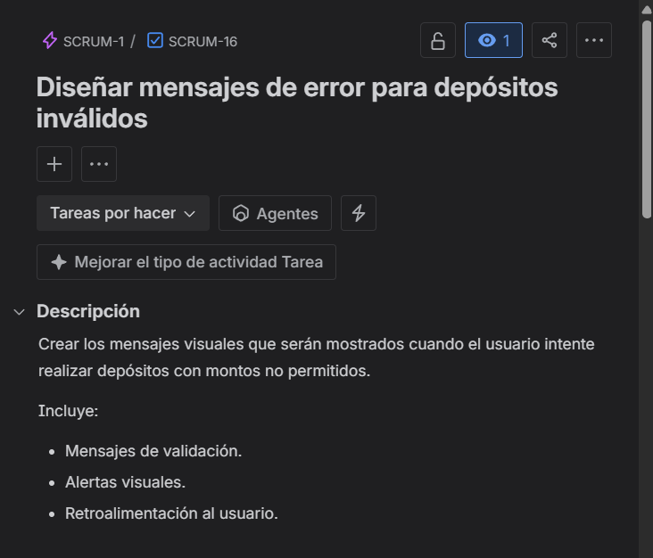

[Ver tarea en Jira](https://teamdosw.atlassian.net/browse/SCRUM-16)

---

### SCRUM-17 - Realizar pruebas funcionales de validación de montos

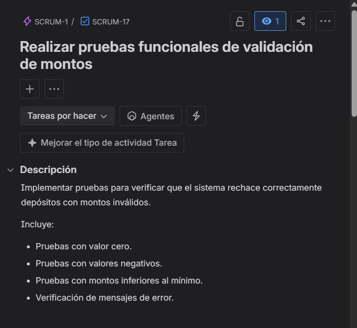

[Ver tarea en Jira](https://teamdosw.atlassian.net/browse/SCRUM-17)

---

## 4. Timeline

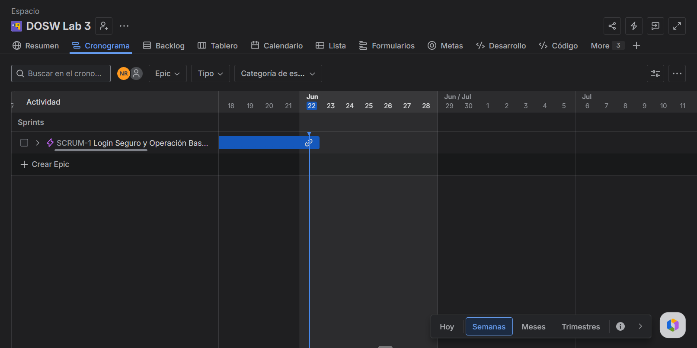

