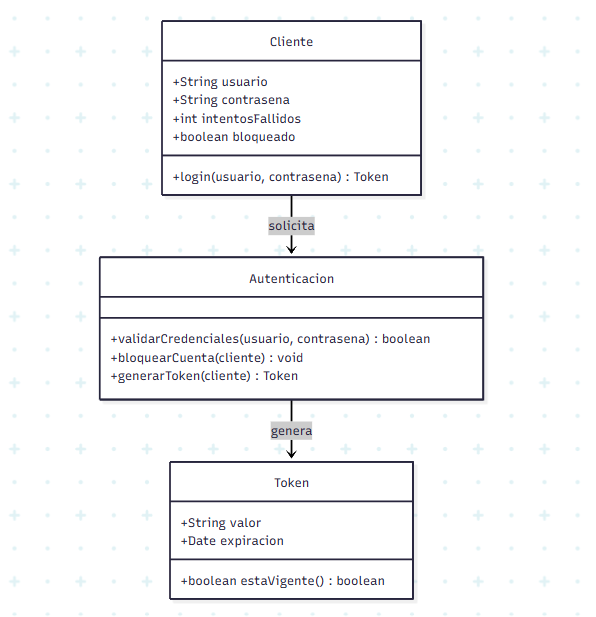
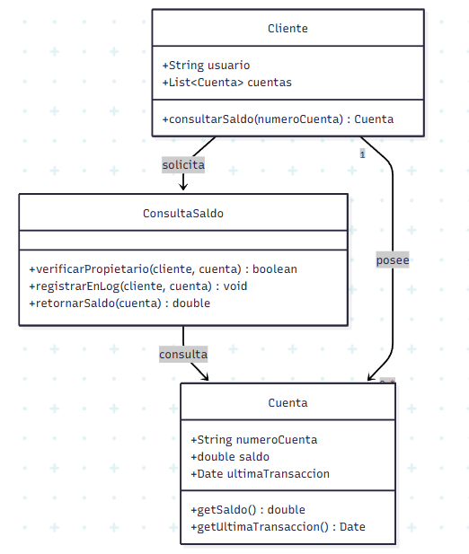
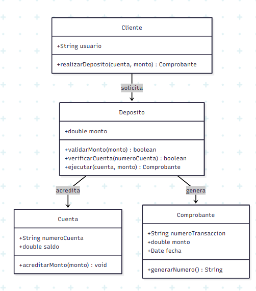

git merge develop
git add .# Documento de Requerimientos
## Sistema Bancario - DOSW Laboratorio 3

**Equipo:** Hever Barrera, Nicolás Prieto, Mabel Bernal
**Fecha:** 2026-06-20
**Versión:** 1.0

---

## Requerimientos Funcionales

| ID   | Descripción |
|------|-------------|
| RF01 | El sistema debe autenticar usuarios con usuario y contraseña |
| RF02 | El sistema debe registrar y validar cuentas bancarias (10 dígitos, banco registrado) |
| RF03 | El sistema debe permitir consultar el saldo de una cuenta por el cliente |
| RF04 | El sistema debe permitir realizar depósitos a una cuenta |
| RF05 | El sistema debe generar reporte tributario en PDF para el cliente |
| RF06 | El sistema debe enviar reporte a la DIAN en formato JSON |
| RF07 | El sistema debe permitir realizar retiros de una cuenta validando saldo disponible |
| RF08 | El sistema debe permitir transferencias entre cuentas registradas |

---

## Detalle de Requerimientos

---

### RF01 - Autenticar usuarios con usuario y contraseña

| Código:          | RF01                                          |
|------------------|-----------------------------------------------|
| Nombre:          | Autenticar usuarios con usuario y contraseña  |

| Descripción:        | El usuario entra al sistema con su nombre de usuario y contraseña. Si los datos son correctos, el sistema le da acceso y le entrega un token para que pueda usar las demás funciones. |
|---------------------|--------------------------------------------------------------------------------------------------------------------------------------------------------------------------------------|
| Cómo se ejecutará:  | El usuario abre la pantalla de inicio, escribe su usuario y contraseña y le da al botón de entrar. |
| Actor principal:    | Cliente |
| Precondiciones:     | El usuario ya tiene que tener una cuenta creada en el sistema. |

**► DATOS DE ENTRADA**

| Nombre      | Descripción              | Tipo de campo | Reglas / Aplicación                          | Obligatorio |
|-------------|--------------------------|---------------|----------------------------------------------|-------------|
| Usuario     | Nombre de usuario        | Texto         | Mínimo 4 caracteres, sin espacios            | Sí          |
| Contraseña  | Clave secreta del usuario| Contraseña    | Mínimo 8 caracteres, al menos 1 número       | Sí          |

**DATOS DE SALIDA**

| Nombre       | Descripción                  | Tipo de campo | Reglas / Aplicación              | Obligatorio |
|--------------|------------------------------|---------------|----------------------------------|-------------|
| Token JWT    | Token de acceso del usuario  | Texto         | Expira en 30 minutos             | Sí          |
| Mensaje      | Resultado de la operación    | Texto         | "Login exitoso" o mensaje error  | Sí          |

**FLUJO BÁSICO:**

| Paso | Actor   | Descripción                                              | Excepciones |
|------|---------|----------------------------------------------------------|-------------|
| 1    | Cliente | Ingresa usuario y contraseña en el formulario            | -           |
| 2    | Sistema | Valida las credenciales contra la base de datos          | Paso 1A     |
| 3    | Sistema | Genera y retorna token JWT                               | -           |
| 4    | Cliente | Accede al sistema con el token                           | -           |

**FLUJO ALTERNO:**

| Paso | Actor   | Descripción                                              | Excepciones |
|------|---------|----------------------------------------------------------|-------------|
| 1A   | Sistema | Credenciales incorrectas, retorna error 401              | -           |
| 1B   | Sistema | Cuenta bloqueada tras 3 intentos fallidos                | -           |

| Notas y comentarios: | El token que se genera al entrar hay que usarlo en todas las demás peticiones para que el sistema sepa quién está haciendo cada acción. |
|----------------------|-----------------------------------------------------------------------------------------------------------------------------------------|

**ANEXOS**

PROTOTIPOS: Formulario de login con campos usuario y contraseña.

**REGLAS DE NEGOCIO**

| No. | Descripción                                                                 |
|-----|-----------------------------------------------------------------------------|
| 1   | Si el usuario se equivoca 3 veces seguidas, la cuenta se bloquea por 15 minutos |
| 2   | El token dura 30 minutos, después de eso el usuario tiene que volver a entrar    |
| 3   | Las contraseñas no se guardan en texto plano, se cifran antes de guardarlas      |

**ABREVIATURAS**

| Abreviatura | Significado                  |
|-------------|------------------------------|
| JWT         | JSON Web Token               |
| RF          | Requerimiento Funcional      |

**HISTORIAL DE REVISIÓN**

| Elaborado por    | Aprobado por | Fecha      | Descripción y Justificación de Cambios |
|------------------|--------------|------------|----------------------------------------|
| CVDS Company     |              | 22/10/2024 |                                        |
| Nicolás Prieto   |              | 20/06/2026 | Creación del requerimiento RF01        |

---

### RF03 - Consultar el saldo de una cuenta por el cliente

| Código:          | RF03                                          |
|------------------|-----------------------------------------------|
| Nombre:          | Consultar el saldo de una cuenta por el cliente |

| Descripción:        | El usuario puede ver cuánto dinero tiene en su cuenta en cualquier momento. Solo puede ver las cuentas que le pertenecen. |
|---------------------|--------------------------------------------------------------------------------------------------------------------------|
| Cómo se ejecutará:  | El usuario entra a su perfil, escoge la cuenta que quiere revisar y el sistema le muestra el saldo al día. |
| Actor principal:    | Cliente |
| Precondiciones:     | El usuario tiene que haber iniciado sesión primero. |

**► DATOS DE ENTRADA**

| Nombre        | Descripción                  | Tipo de campo | Reglas / Aplicación              | Obligatorio |
|---------------|------------------------------|---------------|----------------------------------|-------------|
| Número cuenta | Identificador de la cuenta   | Numérico      | 10 dígitos, cuenta debe existir  | Sí          |
| Token JWT     | Token de sesión del cliente  | Texto         | Debe ser válido y no expirado    | Sí          |

**DATOS DE SALIDA**

| Nombre                  | Descripción                        | Tipo de campo | Reglas / Aplicación         | Obligatorio |
|-------------------------|------------------------------------|---------------|-----------------------------|-------------|
| Saldo disponible        | Saldo actual de la cuenta          | Decimal       | Dos decimales, no negativo  | Sí          |
| Fecha última transacción| Fecha de la última operación       | Fecha         | Formato DD/MM/YYYY HH:mm    | Sí          |

**FLUJO BÁSICO:**

| Paso | Actor   | Descripción                                                    | Excepciones |
|------|---------|----------------------------------------------------------------|-------------|
| 1    | Cliente | Selecciona la cuenta a consultar                               | -           |
| 2    | Sistema | Verifica que la cuenta pertenece al cliente autenticado        | Paso 2A     |
| 3    | Sistema | Retorna saldo actual y fecha de última transacción             | -           |

**FLUJO ALTERNO:**

| Paso | Actor   | Descripción                                                    | Excepciones |
|------|---------|----------------------------------------------------------------|-------------|
| 2A   | Sistema | La cuenta no pertenece al cliente, retorna error 403           | -           |
| 2B   | Sistema | La cuenta no existe, retorna error 404                         | -           |

| Notas y comentarios: | El saldo que se muestra tiene que estar actualizado, o sea que debe incluir todos los movimientos que se hayan hecho hasta ese momento. |
|----------------------|----------------------------------------------------------------------------------------------------------------------------------------|

**ANEXOS**

PROTOTIPOS: Pantalla de detalle de cuenta con saldo y últimos movimientos.

**REGLAS DE NEGOCIO**

| No. | Descripción                                                                 |
|-----|-----------------------------------------------------------------------------|
| 1   | Nadie puede ver el saldo de una cuenta que no es suya                        |
| 2   | La consulta no puede demorar más de 2 segundos                               |
| 3   | Cada vez que alguien consulta su saldo queda guardado en el registro          |

**ABREVIATURAS**

| Abreviatura | Significado                  |
|-------------|------------------------------|
| JWT         | JSON Web Token               |
| RNF         | Requerimiento No Funcional   |

**HISTORIAL DE REVISIÓN**

| Elaborado por    | Aprobado por | Fecha      | Descripción y Justificación de Cambios |
|------------------|--------------|------------|----------------------------------------|
| CVDS Company     |              | 22/10/2024 |                                        |
| Nicolás Prieto   |              | 20/06/2026 | Creación del requerimiento RF03        |

---

### RF04 - Realizar depósitos a una cuenta

| Código:          | RF04                            |
|------------------|---------------------------------|
| Nombre:          | Realizar depósitos a una cuenta  |

| Descripción:        | El usuario puede consignar dinero a una cuenta. El sistema revisa que la cuenta exista y que el monto sea válido antes de hacer el depósito. |
|---------------------|---------------------------------------------------------------------------------------------------------------------------------------------|
| Cómo se ejecutará:  | El usuario elige la cuenta a la que quiere consignar, escribe el valor y confirma. El sistema hace el depósito y le muestra el comprobante. |
| Actor principal:    | Cliente |
| Precondiciones:     | El usuario tiene que haber iniciado sesión y la cuenta a la que va a consignar debe estar registrada. |

**► DATOS DE ENTRADA**

| Nombre        | Descripción                   | Tipo de campo | Reglas / Aplicación                    | Obligatorio |
|---------------|-------------------------------|---------------|----------------------------------------|-------------|
| Número cuenta | Cuenta destino del depósito   | Numérico      | 10 dígitos, cuenta debe existir        | Sí          |
| Monto         | Valor a depositar             | Decimal       | Mayor a 0, máximo 2 decimales          | Sí          |
| Token JWT     | Token de sesión del cliente   | Texto         | Debe ser válido y no expirado          | Sí          |

**DATOS DE SALIDA**

| Nombre               | Descripción                         | Tipo de campo | Reglas / Aplicación              | Obligatorio |
|----------------------|-------------------------------------|---------------|----------------------------------|-------------|
| Comprobante          | Confirmación de la transacción      | Texto         | Número de transacción único      | Sí          |
| Nuevo saldo          | Saldo actualizado tras el depósito  | Decimal       | Dos decimales, no negativo       | Sí          |

**FLUJO BÁSICO:**

| Paso | Actor   | Descripción                                                    | Excepciones |
|------|---------|----------------------------------------------------------------|-------------|
| 1    | Cliente | Selecciona cuenta destino e ingresa el monto                   | -           |
| 2    | Sistema | Valida que el monto sea mayor a cero                           | Paso 2A     |
| 3    | Sistema | Verifica que la cuenta destino existe                          | Paso 3A     |
| 4    | Sistema | Acredita el monto en la cuenta                                 | -           |
| 5    | Sistema | Genera comprobante con número de transacción único             | -           |

**FLUJO ALTERNO:**

| Paso | Actor   | Descripción                                                    | Excepciones |
|------|---------|----------------------------------------------------------------|-------------|
| 2A   | Sistema | Monto inválido (negativo o cero), retorna error de validación  | -           |
| 3A   | Sistema | Cuenta destino no existe, retorna error 404                    | -           |

| Notas y comentarios: | En cuanto se hace el depósito el saldo ya tiene que verse actualizado. Además queda guardado el movimiento para que haya trazabilidad. |
|----------------------|---------------------------------------------------------------------------------------------------------------------------------------|

**ANEXOS**

PROTOTIPOS: Formulario de depósito con campo cuenta destino y monto.

**REGLAS DE NEGOCIO**

| No. | Descripción                                                                 |
|-----|-----------------------------------------------------------------------------|
| 1   | No se puede consignar menos de $1.000 COP                                   |
| 2   | El saldo se actualiza apenas se confirma el depósito                        |
| 3   | Cada depósito tiene un número de comprobante que no se repite               |

**ABREVIATURAS**

| Abreviatura | Significado                  |
|-------------|------------------------------|
| JWT         | JSON Web Token               |
| COP         | Peso Colombiano              |

**HISTORIAL DE REVISIÓN**

| Elaborado por    | Aprobado por | Fecha      | Descripción y Justificación de Cambios |
|------------------|--------------|------------|----------------------------------------|
| CVDS Company     |              | 22/10/2024 |                                        |
| Nicolás Prieto   |              | 20/06/2026 | Creación del requerimiento RF04        |

---

### RF02 - Registrar y validar cuentas bancarias

| Código:          | RF02                                  |
|------------------|---------------------------------------|
| Nombre:          | Registrar y validar cuentas bancarias |

| Descripción:        | El sistema permite registrar una nueva cuenta bancaria para un usuario. Antes de guardarla verifica que el número tenga 10 dígitos y que el banco esté en la lista de bancos permitidos. |
|---------------------|----------------------------------------------------------------------------------------------------------------------------------------------------------------------------------------|
| Cómo se ejecutará:  | El usuario llena el formulario con los datos de la cuenta, el sistema los revisa y si todo está bien la guarda y la asocia a su perfil. |
| Actor principal:    | Cliente |
| Precondiciones:     | El usuario tiene que haber iniciado sesión y no tener ya registrada esa misma cuenta. |

**► DATOS DE ENTRADA**

| Nombre          | Descripción                        | Tipo de campo | Reglas / Aplicación                              | Obligatorio |
|-----------------|------------------------------------|---------------|--------------------------------------------------|-------------|
| Número cuenta   | Número de la cuenta bancaria       | Numérico      | Exactamente 10 dígitos                           | Sí          |
| Banco           | Nombre del banco de la cuenta      | Texto         | Debe estar en la lista de bancos registrados     | Sí          |
| Token JWT       | Token de sesión del usuario        | Texto         | Debe ser válido y no expirado                    | Sí          |

**DATOS DE SALIDA**

| Nombre          | Descripción                            | Tipo de campo | Reglas / Aplicación                        | Obligatorio |
|-----------------|----------------------------------------|---------------|--------------------------------------------|-------------|
| Confirmación    | Mensaje de que la cuenta fue registrada| Texto         | "Cuenta registrada exitosamente"           | Sí          |
| ID cuenta       | Identificador interno de la cuenta     | Numérico      | Generado automáticamente por el sistema    | Sí          |

**FLUJO BÁSICO:**

| Paso | Actor   | Descripción                                                         | Excepciones |
|------|---------|---------------------------------------------------------------------|-------------|
| 1    | Cliente | Llena el formulario con el número de cuenta y el banco              | -           |
| 2    | Sistema | Revisa que el número tenga exactamente 10 dígitos                   | Paso 2A     |
| 3    | Sistema | Verifica que el banco esté en la lista de bancos permitidos         | Paso 3A     |
| 4    | Sistema | Guarda la cuenta y la asocia al perfil del usuario                  | -           |
| 5    | Sistema | Le muestra al usuario un mensaje de confirmación                    | -           |

**FLUJO ALTERNO:**

| Paso | Actor   | Descripción                                                         | Excepciones |
|------|---------|---------------------------------------------------------------------|-------------|
| 2A   | Sistema | El número no tiene 10 dígitos, le avisa al usuario                  | -           |
| 3A   | Sistema | El banco no está en la lista, le pide que escoja uno válido         | -           |
| 4A   | Sistema | La cuenta ya estaba registrada, le dice que no puede agregarla otra vez | -       |

| Notas y comentarios: | La lista de bancos permitidos la administra el sistema, no el usuario. Si un banco no aparece ahí, simplemente no se puede registrar. |
|----------------------|--------------------------------------------------------------------------------------------------------------------------------------|

**ANEXOS**

PROTOTIPOS: Formulario de registro de cuenta con campo número y selector de banco.

**REGLAS DE NEGOCIO**

| No. | Descripción                                                                      |
|-----|----------------------------------------------------------------------------------|
| 1   | El número de cuenta debe tener exactamente 10 dígitos, ni más ni menos           |
| 2   | Solo se aceptan bancos que estén en la lista del sistema                         |
| 3   | Un usuario no puede registrar la misma cuenta dos veces                          |

**ABREVIATURAS**

| Abreviatura | Significado             |
|-------------|-------------------------|
| JWT         | JSON Web Token          |
| RF          | Requerimiento Funcional |

**HISTORIAL DE REVISIÓN**

| Elaborado por    | Aprobado por | Fecha      | Descripción y Justificación de Cambios |
|------------------|--------------|------------|----------------------------------------|
| CVDS Company     |              | 22/10/2024 |                                        |
| Nicolás Prieto   |              | 20/06/2026 | Creación del requerimiento RF02        |

---

### RF05 - Generar reporte tributario en PDF para el cliente

| Código:          | RF05                                            |
|------------------|-------------------------------------------------|
| Nombre:          | Generar reporte tributario en PDF para el cliente |

| Descripción:        | El sistema le genera al cliente un reporte en PDF con el resumen de sus movimientos para efectos tributarios. El cliente lo puede descargar desde su perfil. |
|---------------------|-------------------------------------------------------------------------------------------------------------------------------------------------------------|
| Cómo se ejecutará:  | El usuario entra a la sección de reportes, escoge el período que quiere y le da a generar. El sistema arma el PDF y se lo entrega para descargar. |
| Actor principal:    | Cliente |
| Precondiciones:     | El usuario tiene que haber iniciado sesión y tener al menos una transacción registrada en el período seleccionado. |

**► DATOS DE ENTRADA**

| Nombre          | Descripción                          | Tipo de campo | Reglas / Aplicación                          | Obligatorio |
|-----------------|--------------------------------------|---------------|----------------------------------------------|-------------|
| Fecha inicio    | Inicio del período del reporte       | Fecha         | No puede ser mayor a la fecha fin            | Sí          |
| Fecha fin       | Fin del período del reporte          | Fecha         | No puede ser una fecha futura                | Sí          |
| Token JWT       | Token de sesión del usuario          | Texto         | Debe ser válido y no expirado                | Sí          |

**DATOS DE SALIDA**

| Nombre          | Descripción                              | Tipo de campo | Reglas / Aplicación                        | Obligatorio |
|-----------------|------------------------------------------|---------------|--------------------------------------------|-------------|
| Archivo PDF     | Reporte tributario del período           | Archivo       | Formato PDF, nombre con fecha de generación| Sí          |

**FLUJO BÁSICO:**

| Paso | Actor   | Descripción                                                              | Excepciones |
|------|---------|--------------------------------------------------------------------------|-------------|
| 1    | Cliente | Entra a la sección de reportes y escoge el período                       | -           |
| 2    | Sistema | Revisa que las fechas sean válidas                                        | Paso 2A     |
| 3    | Sistema | Busca todas las transacciones del usuario en ese período                  | Paso 3A     |
| 4    | Sistema | Genera el PDF con el resumen de movimientos                               | -           |
| 5    | Cliente | Descarga el archivo PDF                                                   | -           |

**FLUJO ALTERNO:**

| Paso | Actor   | Descripción                                                              | Excepciones |
|------|---------|--------------------------------------------------------------------------|-------------|
| 2A   | Sistema | Las fechas no son válidas, le avisa al usuario                           | -           |
| 3A   | Sistema | No hay transacciones en ese período, le informa al usuario               | -           |

| Notas y comentarios: | El PDF debe tener el logo del sistema, los datos del cliente y el detalle de cada transacción con fecha, tipo y monto. |
|----------------------|-----------------------------------------------------------------------------------------------------------------------|

**ANEXOS**

PROTOTIPOS: Pantalla de reportes con selector de fechas y botón de descarga.

**REGLAS DE NEGOCIO**

| No. | Descripción                                                                      |
|-----|----------------------------------------------------------------------------------|
| 1   | El reporte solo muestra las transacciones del usuario que lo solicita            |
| 2   | El período máximo que se puede consultar es de un año                            |
| 3   | El archivo se genera en el momento, no se guarda en el servidor                  |

**ABREVIATURAS**

| Abreviatura | Significado             |
|-------------|-------------------------|
| JWT         | JSON Web Token          |
| PDF         | Portable Document Format|

**HISTORIAL DE REVISIÓN**

| Elaborado por    | Aprobado por | Fecha      | Descripción y Justificación de Cambios |
|------------------|--------------|------------|----------------------------------------|
| CVDS Company     |              | 22/10/2024 |                                        |
| Nicolás Prieto   |              | 20/06/2026 | Creación del requerimiento RF05        |

---

## Análisis Crítico

### a) ¿Identifica algún requerimiento que deba detallarse más?

El RF06 del envío del reporte a la DIAN le falta bastante detalle. No queda claro qué campos exactos hay que mandar, cada cuánto se envía, ni qué pasa si la DIAN lo rechaza. Eso hay que definirlo bien antes de ponerse a programarlo.

### b) ¿Existen requerimientos que se contradigan entre sí?

El RF05 y el RF06 se pueden complicar entre sí. Uno genera el reporte en PDF para el cliente y el otro lo manda a la DIAN en JSON, pero si la información que va en cada uno es diferente o tiene formatos distintos, toca hacer dos cosas por separado cuando podría ser una sola. Hay que ponerse de acuerdo en cómo se maneja eso desde el principio.

### c) ¿Cuáles serían los 2 más importantes para una primera iteración?

1. **RF01 - Autenticación:** Sin esto no funciona nada, porque todas las demás funciones necesitan saber quién es el usuario antes de dejarlo hacer algo.
2. **RF04 - Depósitos:** Es la operación más básica de cualquier sistema bancario y nos permite probar que el core del sistema está funcionando bien.

### d) ¿Existe algún requerimiento que NO debería realizarse en el MVP?

El RF06 del reporte a la DIAN no debería ir en el MVP. Ese punto depende de cosas externas que no controlamos, como la API de la DIAN, y si nos ponemos a trabajar en eso desde el inicio podemos bloquearnos sin haber terminado lo más importante.
